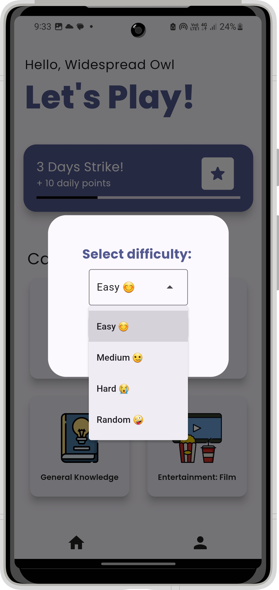

<div align="center">
    
    <a href="https://play.google.com/store/apps/details?id=dev.thedreamcatcher.quizzit">
        
    </a>
</div>

## 📚 Introduction

Our project was inspired by the need to help people practice for quizzes and exams effectively while gaining knowledge. We noticed that many individuals struggle with traditional study methods and wanted to create an interactive solution. Our quiz app allows users to test their knowledge, identify areas for improvement, and make learning enjoyable.
- [Deployed Site](https://quizzit.thedreamcatcher.dev/)
- [Final Project Blog Article](https://medium.com/@shenouda.mikhael/quizzit-445a123f6521)
- Authors Linkedin
  - [Abdulrhman Mohammed](https://www.linkedin.com/in/abduhany/)
  - [Salsabil Ahmed](https://www.linkedin.com/in/salsabil-ahmed-642a77287/)
  - [Shenouda Mikhael](https://www.linkedin.com/in/shenoudamikhael/)
  <div align="center">
    <a href="https://www.linkedin.com/in/abduhany/">
        
    </a>
    <a href="https://www.linkedin.com/in/salsabil-ahmed-642a77287/">
        
    </a>
    <a href="https://www.linkedin.com/in/shenoudamikhael/">
        
    </a>
  </div>

## ✨ Features
- Choose from different categories which are always up-to-date.
- Select your level of difficulty for personalized content.
- Track your progress and monitor improvements over time.

## 📥 Installation
 
Install [**Quizzit**](https://play.google.com/store/apps/details?id=dev.thedreamcatcher.quizzit) Where every question is an adventure!

## 📦 Dependencies
- **Back-End:**
  - **`dio: ^5.4.3+1`** - HTTP requests package for API service

## 📌 Usage
#### Choosing a Category 🔖
- Browse through the available categories and choose one that interests you.
#### Selecting a Difficulty Level 📊
- After selecting a category, you will be prompted to choose your level of difficulty.
- Select the difficulty level that suits your experience.
#### Tracking Your Progress 📈
- Navigate to the "Profile" tab.
- View detailed statistics showing your performance over time.
#### Edit Your Profile 👤
- Navigate to the "Profile" tab
- Tab "Settings" icon and choose "Edit Profile"
- You can edit your Name, Date of birth and Gender.

## 📡 APIs

- #### Get the quiz db file with the specified category from the back-end.

```
  GET /api/v1/quiz
```

- #### Get the status of the backend API.

```
  GET /api/v1/status
```

- #### Get the most updated version of the quiz json file.

```
  GET /api/v1/version
```

## 🔗 Related Repositories
- [Frontend Repository](https://github.com/ShenoudaMikhael/quizzit_frontend) - This repository contains the frontend code for our application.

## 📜 MIT License

Copyright ©️ 2024 Abduhany    
Copyright ©️ 2024 Salsapil    
Copyright ©️ 2024 ShenoudaMikhael   

Permission is hereby granted, free of charge, to any person obtaining a copy
of this software and associated documentation files (the "Software"), to deal
in the Software without restriction, including without limitation the rights
to use, copy, modify, merge, publish, distribute, sublicense, and/or sell
copies of the Software, and to permit persons to whom the Software is
furnished to do so, subject to the following conditions:

The above copyright notice and this permission notice shall be included in all
copies or substantial portions of the Software.

THE SOFTWARE IS PROVIDED "AS IS", WITHOUT WARRANTY OF ANY KIND, EXPRESS OR
IMPLIED, INCLUDING BUT NOT LIMITED TO THE WARRANTIES OF MERCHANTABILITY,
FITNESS FOR A PARTICULAR PURPOSE AND NONINFRINGEMENT. IN NO EVENT SHALL THE
AUTHORS OR COPYRIGHT HOLDERS BE LIABLE FOR ANY CLAIM, DAMAGES OR OTHER
LIABILITY, WHETHER IN AN ACTION OF CONTRACT, TORT OR OTHERWISE, ARISING FROM,
OUT OF OR IN CONNECTION WITH THE SOFTWARE OR THE USE OR OTHER DEALINGS IN THE
SOFTWARE.

## 📸 App Screenshots

<p align="center">
    
    
    
</p>

## 💡 Project Inspiration
Our project was inspired by the need to help people practice for quizzes and exams effectively while gaining knowledge. We noticed that many individuals struggle with traditional study methods and wanted to create an interactive solution. Our quiz app allows users to test their knowledge, identify areas for improvement, and make learning enjoyable. *We aim to enhance the learning experience and support users in achieving their goals.*

## ⏳ Technical challenges
- Learning New Technologies:
  - Learning Flutter and Dart for frontend development.
  - Understanding Node.js and Express for backend development.
  - Getting proficient with Rive for creating animations.
  so invested considerable time in grasping the intricacies and best practices of these technologies.

- Sourcing Quiz Questions:
  - Implementing web scraping to gather quiz questions.

- Creating and Integrating Animations:
  - Developing engaging animations in Rive.
  - Seamlessly integrating these animations into the Flutter app.


## 👨🏻‍💻 Authors

- [@AbdelrahmanMetawei](https://github.com/Abduhany/)
- [@SalsabilAhmed](https://github.com/Salsapil)
- [@ShenoudaMikhael](https://github.com/ShenoudaMikhael)
